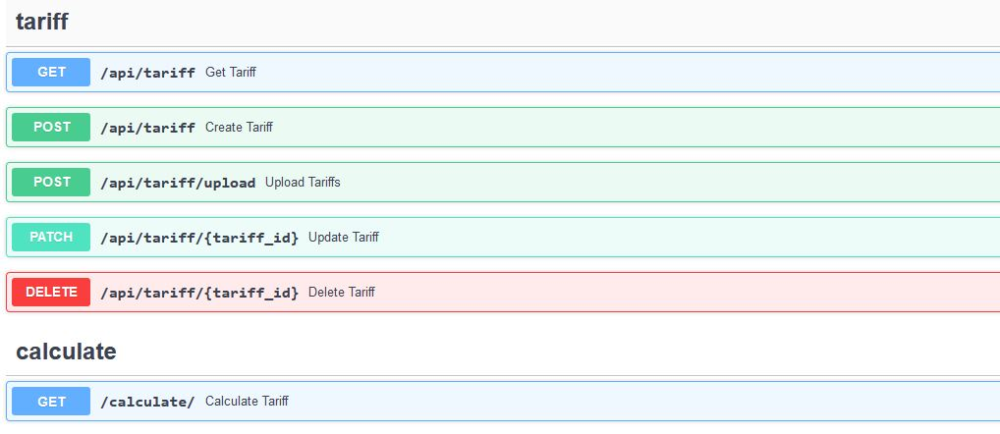
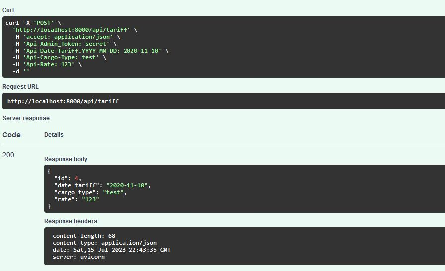
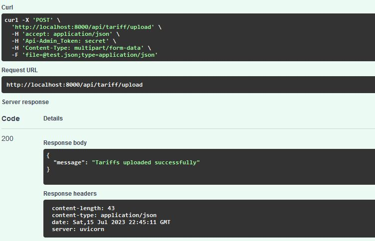
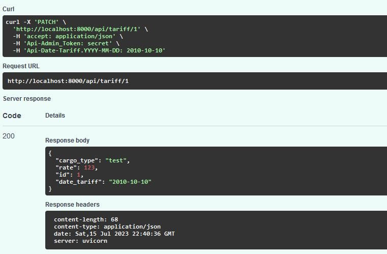
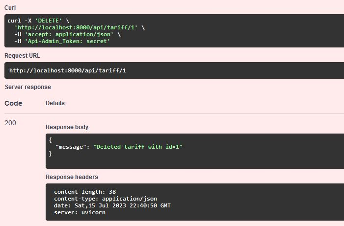
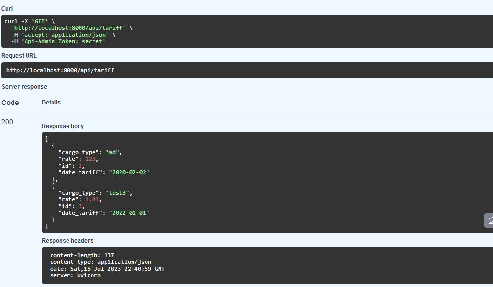
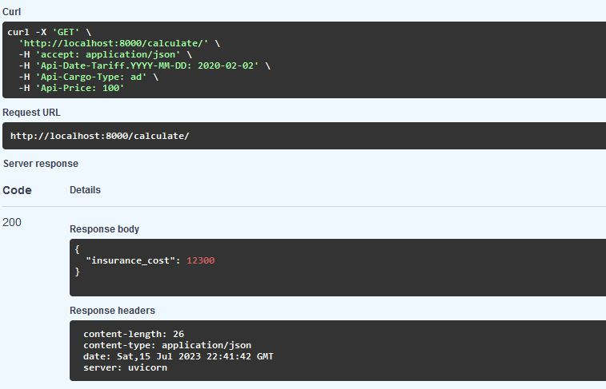

# Insurance api

Публичный API сервис по расчёту стоимости страхования груза в зависимости от его типа и объявленной стоимости. Принимает дату, тип и стоимость груза, возвращает стоимость страхования.

Рееализован REST API для просмотра, добавления (через JSON-файл или запрос), изменения и удалениявозмонжномтьвыдача токена администратору по логину/паролу для доступа к RESTfull api для просмотра, добавления, изменения и удаления страхового тарифа. Для доступа нужен секретный ключ

## Установка
### Клонируем репозиторий
    mkdir app
    cd cat app
    git clone https://github.com/se-andrey/insurance_api.git

### Создаем .env
    nano .env

Указываем ключ доступа и данные для доступа к БД
    
    DB_PORT=
    DB_NAME=
    DB_USER=
    DB_PASS=
    SECRET=

Если на сервере нет docker/docker-compose, то установите его - инструкция https://docs.docker.com/
    
	docker-compose up --build 

Для остановки
    
	docker-compose down 

### Пример использования

#### Эндпоинты

#### REST API для тарифов
##### Добавление тарифа

##### Добавление тарифа через отправку json-файла

#### Редактирование тарифа

#### Удаление тарифа

#### Получение списка тарифов

#### API сервис по расчёту стоимости страхования груза

